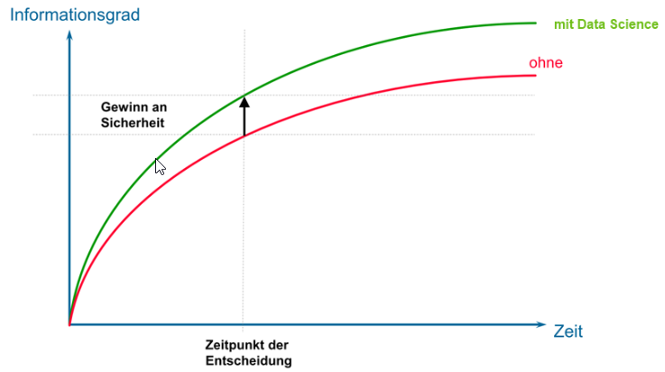
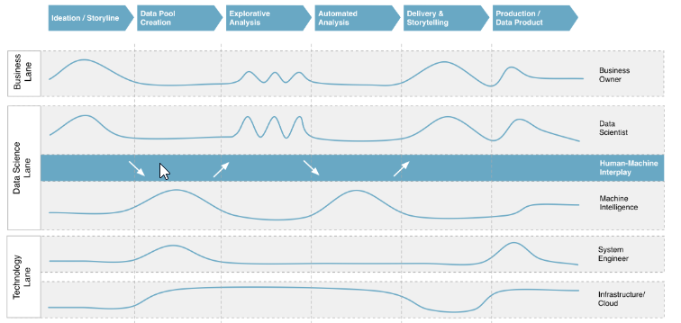
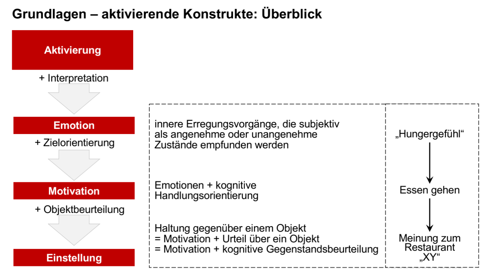
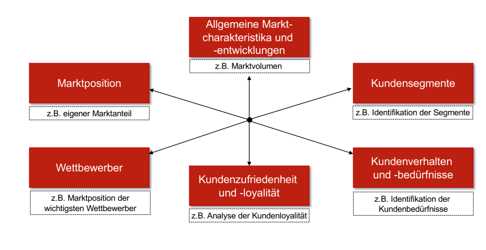
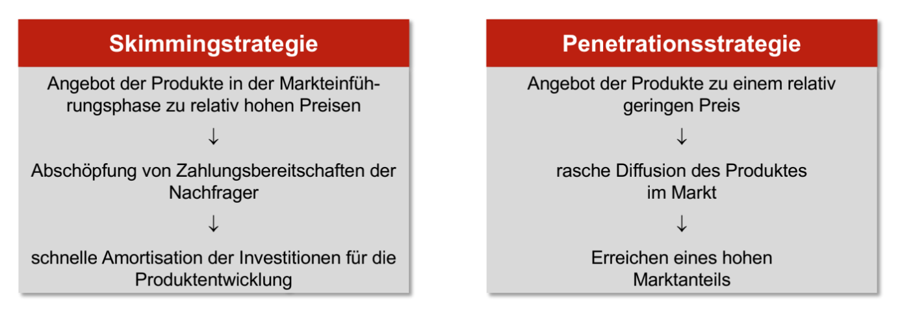

# Fächer
## Grundlagen der Programmierung
### Funktionen
- **Vorteile**
  - kleiner und leichter nachvollziehbare Schritte in einem Programm
  - verringert doppelten Code
  - erleichtert Lesbarkeit und Wartung
  - ermöglicht Wiederverwendung von Code → libraries
  - erleichtert Teamaufteilung
  - kann details vor Anwender verstecken → leichter
- **Nachteile**
  - erhöhter Aufwand in der Programmierung
  - Funktionsaufrufe verlangsamen die Performance
### Parameterübergabe
- arguments
- default arguments
- call by reference (wird in Funktion verändert) vs call by value (direkte Übergabe der Werte)
- args, kwargs
### Functions as first class citizens
- functions can return functions (->recursion)
- function can take other function as parameter
- function can be defined inside other functions
### Closure
Inner function is the return value of outside function. Pay attention to which function is used
### OOP
Separation of Code to Classes, Superclasses and functions to integrate patterns improve readability, adaption of code and reuseability
### Rekursion
Funktion ruft sich selbst so oft auf, bis Abbruchbedingung auftritt.
## Einführung in die BWL
### Wirtschaftsprinzipien
- Einnahmen ≥ Ausgaben
- Maximalprinzip
- Minimalprinzip
### Faktoren der Unternehmensumwelt
1. **Natürliches Umfeld**
    - Rohstoffquelle und Energielieferant
    - Müllentsorgung
    - Qualitätsmerkmal bspw. für Tourismus
1. **Technologische Umfeld**
    - Techn. Fortschritt betrifft Material, Produktionsverfahren und Produkte
    - Früher Einsatz von neuen Werkstoffen und Technologien bietet einen Vorsprung gegenüber der Konkurrenz
2. **Sozio-kulturelles Umfeld**
    - Höhere Lebenserwartung, Zeitgeist-Phänomene
    - Trend zu stärker individualisierten Sachgütern und Dienstleistungen
3. **politisch-rechtliches Umfeld** 
    - Subventionen, Steuern und Abgaben
    - Regulatorische Themen: Gesetzgebung, bspw. Umweltschutz
4. **markoökonomische Umfeld**
    - Wechselkurse, Rohstoffpreise und Entwicklung der Kapitalmärkte
    - Immer stärker ausgeprägte internationale Wertschöpfungsketten
5. **marktliche Umwelt**
    - Marktstruktur, geprägt von Anzahl und Größe der Anbiete und Nachfrager
        
        → Monopol, Oligopol, Polypol
        
    - Größenverhältnisse und Marktanteile
        
        → wenig Konkurrenz (monopolartige Stellung) oder mehrere Unternehmen die zusammen den Markt bestimmen (oligopolartige Stimmung)
### Unternehmensführung
- Normative Ebene

Mission und Vision, Ziele, Werte

- Strategische Ebene

Portfolio, Strategien, Geschäftsmodelle

- Operative Ebene

Budgets, operative Maßnahmen, etc.
### Rechtsformen und Begriffe
Kaufmann:
im Sinne des Gesetzes ist, wer ein Handelsgewerbe (Gewerbe) betreibt (§1(1) HGB)

Gewerbe:
gegeben durch selbständige Tätigkeit, die auf Gewinnerzielung und planmäßige Wiederholung ausgerichtet ist. Nicht aber Ärzte, Anwälte und andere freie Berufe

Firma:
vollständigen offiziellen Namen eines Unternehmens. Die Firma eines Kaufmanns ist der Name, unter dem er seine Geschäfte betreibt und die Unterschrift abgibt (§17(1) HGB)

Natürliche Person:
ein Mensch

Juristische Person:
rechtliche Einheit mit eigener Rechtspersönlichkeit
- Einzelunternehmen
- Personengesellschaften (GbR, OHG, KG)
- Kapitalgesellschaften(AG, Se, GmbH, UG)
- Genossenschaften
- Sonderformen(GmbH & Co. KG, KGaA)
### Budgetplanung
- Top-Down Budgetierung
- Bottom-Up Budgetierung
- Gegenstrom Budgetierung
### Arten von Innovationen
1. Technologische Innovation
    
    → führt zu neuartigen Sachgütern, verändert oft auch die Produktion im Unternehmen (Brillengläser aus Kunststoff)
    
2. Dienstleistungs- oder Serviceinnovation
    
    → führen zu veränderten oder neuartigen Leistungsangeboten (Fernwartung von Anlagen)
    
3. Geschäftsmodell-Innovation
    
    → Veränderung oder Schaffung eines neuen Geschäftsmodells (Neuer Verkaufskanal im Internet)
    
4. Marketinginnovation
    
    → neuartige Marketing oder Verkaufsmethode (Influencermarketing)
    
5. Sozial- /Organisatorische Innovation
    
    →betrifft betriebliche Strukturen (Arbeit in Gruppen statt Einzelaufgaben)
### S-Kurven und Innovation
- radikale Innovation
- inkrementelle Innovation
- S-Kurve

kurzer Verlust von Leistung bei radikaler Innvoation; langfristige Realisierung des Potentials durch inkrementelle Innovation
### Schutzrechte in DE
- Patent
- Gebrauchsmuster
- eingetragenes Design
## Gesellschaftsrecht
### Kaufvertrag
Ein Kaufvertrag nach dem Bürgerlichen Gesetzbuch (BGB) ist ein Vertrag zwischen zwei Parteien, bei dem eine Partei eine Ware oder Dienstleistung im Gegenzug für die Zahlung von Geld kauft. Der Vertrag muss den Preis, die Lieferungszeit, die Haftung des Verkäufers im Falle einer mangelhaften Lieferung und die Rechte und Pflichten beider Parteien im Falle eines Streits enthalten und schließlich unterschrieben werden, um gültig zu sein.
### Pflichtverletzungen beim Kaufvertrag
Bei einem Kaufvertrag können Pflichtverletzungen vorkommen, wenn eine Partei ihre vertraglich vereinbarten Verpflichtungen nicht erfüllt. Einige Beispiele für Pflichtverletzungen im Zusammenhang mit einem Kaufvertrag sind:
- Verspätete oder unvollständige Lieferungen
- Nichteinhaltung der vereinbarten Qualitätsstandards
- Nichteinhaltung der vereinbarten Zahlungsbedingungen
- Nichteinhaltung der vereinbarten Lieferbedingungen
### Gehilfen 
Ein Verrichtungsgehilfe ist eine Person, die im Rahmen eines Kaufvertrags eine gesetzlich vorgeschriebene Handlung für eine andere Person ausführt. Ein Erfüllungsgehilfe hingegen ist jemand, der im Rahmen eines Kaufvertrags eine Handlung für eine andere Person ausführt, die nicht gesetzlich vorgeschrieben ist. Ein Erfüllungsgehilfe kann zum Beispiel ein Logistikunternehmen oder ein Transportunternehmen sein, das im Rahmen eines Kaufvertrags Materialien oder Waren transportiert. In solchen Fällen ist der Erfüllungsgehilfe nicht dazu verpflichtet, den Kaufvertrag zu erfüllen, aber er muss die gesetzlich vorgeschriebenen Anforderungen erfüllen, um die vereinbarten Leistungen zu erbringen.
### Schadenersatz und Mängelgewährleistung
Bei einem Kaufvertrag haben die Parteien Anspruch auf Schadensersatz und Mängelgewährleistung. Wenn eine Partei nicht in der Lage ist, die vertraglich vereinbarten Leistungen zu erbringen, ist sie verpflichtet, dem anderen eine Entschädigung zu zahlen. Ebenso kann ein Anspruch auf Mängelgewährleistung bestehen, wenn eine Partei nicht in der Lage ist, ihren vertraglichen Verpflichtungen nachzukommen.

Der Anspruch auf Schadensersatz ist in der Regel einmalig und erfordert eine einmalige Zahlung. Wenn eine Partei einen Anspruch auf Mängelgewährleistung hat, kann sie die Gewährleistung geltend machen, indem sie eine Geldentschädigung für den Schaden verlangt, der durch die Pflichtverletzung verursacht wurde. In einigen Fällen kann die Gewährleistung auch dazu führen, dass eine Partei eine bestimmte Leistung erbringt, um die vereinbarten Verpflichtungen zu erfüllen.
### Arten von Mängeln
Ein Mangel kann bezüglich der vereinbarten Beschaffenheit, der Eignung für die vertraglich vorausgesetzte Verwendung oder der Eignung für die gewähnliche Verwendung (inkl. Werbeaussagen) geltend gemacht werden. 
### Nebenpflichten 
Nebenpflichten sind vertragliche Verpflichtungen, die neben den Hauptpflichten vereinbart werden. Beispiele für Nebenpflichten im Zusammenhang mit einem Kaufvertrag sind die Pflicht zur rechtzeitigen und korrekten Lieferung der gekauften Waren, die Einhaltung bestimmter Qualitätsstandards und die Pflicht, die vereinbarten Zahlungsbedingungen einzuhalten. Diese Nebenpflichten sind ebenso wichtig wie die Hauptpflichten, denn sie tragen dazu bei, dass der Kaufvertrag einwandfrei erfüllt wird. Wenn eine Partei ihre Nebenpflichten nicht einhält, kann dies zu Pflichtverletzungen und zur Nichterfüllung des Kaufvertrags führen.
## Intro to Data Science
### Data Science und deren Vorteil
Data Science is the study of understanding, analyzing and interpreting data to gain insights and knowledge. It is an interdisciplinary field that uses various methods, techniques, and algorithms to analyze large datasets to uncover hidden patterns, correlations, and trends.

### Phasenmodell der Data Science

### Datentransformation
1. Harmonisierung: syntaktische, sematische, Auflösen von Redundanzen
2. Integration: Reduktion, Verdichtung, Diskretisierung, Aggregation, Hierachienbildung, Anreicherung, Sichten
### Arten des Lernens 

### Underfitting und Overfitting#
Beim Overfitting ist der Lernalgorithmus oder das Modell für die vorliegenden Trainingsdaten zu komplex. Das bewirkt beispielsweise eine Erkennung von Mustern die tatsächlich nicht vorhanden sind. → oft hohe Genauigkeit auf Trainingsdaten, aber ungenau auf neuen Daten. Lösung durch einfacheren Algorithmus, Restriktionen des Algorithmus, weniger Features, mehr Daten, Reduktion von Rauschen
Beim Underfitting ist der Lernalgorithmus oder das Modell für die vorliegenden Trainingsdaten zu simpel. Der Algorithmus erkennt relevante Strukturen nicht und hat sowohl bei Trainingsdaten als auch bei neuen Daten eine große Ungenauigkeit.
Lösung durch komplexeren Algorithmus, mehr Features, weniger Restriktionen.
### Validierung der Modelle
Aufsplittung der Daten vor dem Training in einen Trainingsdatensatz und einen Testdatensatz. Der Trainingsdatensatz wird für das Training des Modells verwendet. Der Testdatensatz wird für die Validierung des Modells verwendet.

No-Free-Lunch-Theorem: Es gibt keinen Algorithmus, der für alle Probleme die beste Lösung liefert. Es gibt immer einen Algorithmus, der für ein bestimmtes Problem die beste Lösung liefert.
Möglichkeiten zur Validierung:
- Confusion Matrix
- Precision
- Recall
- f-score
- accuracy
## Marketing
### Vier Ps des Marketing-Mix
- Produkt
- Preis
- Platz
- Promotion
### Aktivierenden Konstrukte des Konsumentenverhaltens

### Marktforschung

Dabei wichtig sind die Aspekte Objektivität, Reliabilität und Validität.
### Produktbegriffe:
*substanzieller Produktbegriff:* Produktbegriff, der physisch-technische Eigenschaften umfasst.
*erweiterter Produktbegriff:* Produktbegriff, der auch die Dienstleistungen aber nicht psychologischen Nutzen mit erfasst. 
*generischer Produktbegriff:* Allumfassender Produktbegriff.
### Produktstrategien
- Produktvariation
    sehr vergleichbares Produkt, welches in verschiedenen Eigenschaften modifiziert wird. (neuer Generation VW Golf)
- Produktdifferenzierung
    Erweiterung eines Bereits eingeführten Produkts um Ableger (KitKat und KitKat Chunky)
- Diversifikation
    Einführung gänzlich neuer Produkte (Apple Watch)
### Preisstrategien

### Preistheorie
*klassische Preistheorie:* Preise werden durch Angebot und Nachfrage bestimmt.
*verhaltenswissenschaftliche Preistheorie:* Preise werden durch die Wahrnehmung des Kunden bestimmt.

## Logik und Algebra
## Einführung in die Wirtschaftsinformatik
## Grundlagen der IT 1